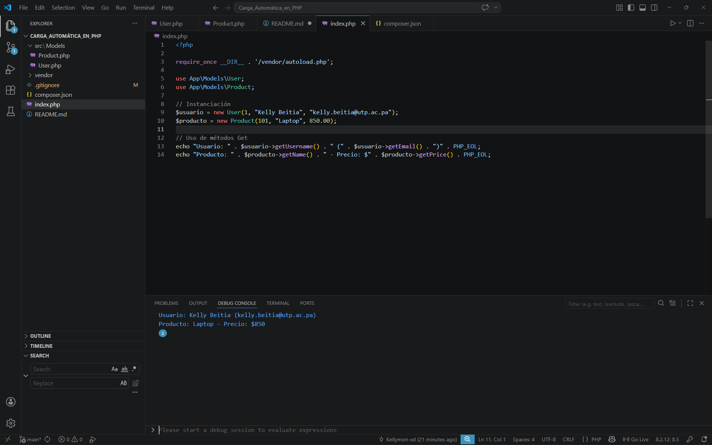

# Laboratorio: Implementación de Autoload PSR-4 con Composer

Estudiante: Kelly Beitia  
Cédula: 8-1023-152  
Universidad Tecnológica de Panamá  
Materia: Desarrollo de Software VII  
Fecha: 27 de abril de 2026


## Introducción

El objetivo de este laboratorio es implementar la carga automática de clases (**Autoload**) bajo el estándar **PSR-4** utilizando Composer.

Se busca eliminar la dependencia de sentencias manuales como `include` o `require`, organizando el código mediante **namespaces** y optimizando la escalabilidad del proyecto PHP.


## Estructura y Estándar PSR-4

El estándar **PSR-4** describe una especificación para la carga automática de clases desde rutas de archivos. En este proyecto, se ha establecido la siguiente relación:

- **Namespace raíz:** `App\`

- **Directorio fuente:** `src/`

- **Mapeo:** Cualquier clase bajo el namespace `App\` se buscará automáticamente dentro de la carpeta `src/`.

---

---

## Guía de instalación

Para ejecutar este proyecto tras clonar el repositorio, sigue estos pasos:

### 1. Clonar el repositorio
```bash
git clone https://github.com/Kellymon-xd/Laboratorio-4-Carga_Automatica_en_PHP
cd Laboratorio-4-Carga_Automatica_en_PHP
```

### 2. Instalar dependencias
Si la carpeta `vendor` no existe:
```bash
composer install
```

### 3. Regenerar el autoload
```bash
composer dump-autoload
```

---

## Estructura de archivos

Relación entre Namespaces y carpetas:

```
Proyecto/
├── composer.json           # Configuración del Autoload PSR-4
├── index.php               # Punto de entrada
├── src/                    # Namespace App\\
│   └── Models/             # Namespace App\\Models
│       ├── Product.php
│       └── User.php
└── vendor/                 # Generado por Composer
    └── autoload.php
```

---

## Pruebas de ejecución

Archivo `index.php`:

```php
<?php

require_once __DIR__ . '/vendor/autoload.php';

use App\Models\User;
use App\Models\Product;

// Instanciación
$usuario = new User(1, "Kelly Beitia", "kelly.beitia@utp.ac.pa");
$producto = new Product(101, "Laptop", 850.00);

// Uso de métodos Get
echo "Usuario: " . $usuario->getUsername() . " (" . $usuario->getEmail() . ")" . PHP_EOL;
echo "Producto: " . $producto->getName() . " - Precio: $" . $producto->getPrice() . PHP_EOL;
```

### Resultado

```
Usuario: Kelly Beitia (kelly.beitia@utp.ac.pa)
Producto: Laptop - Precio: $850
```



## Conclusiones Técnicas

Durante el laboratorio se observaron las siguientes ventajas críticas:

- **Mantenibilidad:** Se pueden añadir cientos de clases en `src/` y el sistema las reconocerá sin necesidad de modificar el archivo `index.php` o agregar múltiples instrucciones `require`.

- **Eficiencia de memoria:** PHP solo carga en memoria el archivo de la clase cuando esta es instanciada, utilizando un comportamiento conocido como **Lazy Loading**.

- **Estandarización:** El uso de PSR-4 permite que el proyecto sea compatible con herramientas modernas de PHP y facilita el trabajo colaborativo mediante una jerarquía de carpetas predecible.

- **Escalabilidad:** La estructura facilita el crecimiento del proyecto, ya que nuevas clases pueden organizarse en subcarpetas manteniendo el mismo namespace base.

---

## 8. Fuentes Bibliográficas

PHP-FIG. (2026). PSR-4: Autoloader.  
https://www.php-fig.org/psr/psr-4/

Composer Documentation. (2026). Basic usage and Autoloading.  
https://getcomposer.org/doc/01-basic-usage.md

W3Schools. (2026). PHP Namespaces.  
https://www.w3schools.com/php/php_namespaces.asp

---

Este laboratorio ha sido desarrollado por el estudiante de la Universidad Tecnológica de Panamá:

Nombre: Kelly Beitia

Correo: kellysteffany10@gmail.com

Curso: Desarrollo de Software VII

Instructor del Laboratorio: Ing. Irina Fong
